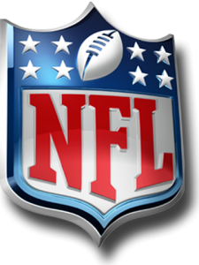

# nfl-injury-tracker

  

# Contributors

[Adam Whitman](https://github.com/emagdaeh "Adam Whitman")

# Introduction

The NFL Injury Tracker is a personal project I built to be a tie-breaker when making Fantasy Football draft choices.  Everyone needs the extra edge in their drafts, and this is mine.  I gave myself 48 hours to build this from start to finish, but I anticipate future enhancements to turn this into a deployable app.

The app takes in injury data for a player and their current team.  The player data is a percentage of games played versus games missed over the span of their career.  The team data is a weighted score of injury designations for each game in each season going back 10 seasons.

The purpose of the app is to provide not only player injury rates, but also how well each team can keep their players healthy.  If a user is down to two players of equal caliber, having a metric like being able to stay on the field is a great metric to help make the decision on who to draft.

# Tech Stack

<ul>
<li>React</li>
<li>Express</li>
<li>Axios</li>
<li>PostgreSQL</li>
<li>CSS Modules</li>
<li>Brotli</li>
<li>Webpack</li>
<li>Babel</li>
</ul>

# Technical Challenges

The most prominent technical challenge I faced was trying to get access to the NFL.com API.  The documentation suggested that I could get an authorization token, but wasn't fully clear on how to receive one.  However, after an extensive trial and error process I was able to receive a token.  I still wasn't able to get any data back from NFL.com.  Once again, after much troubleshooting and seeking out second and third opinions from other senior level engineers the conclusion was reached that even though I had an authorization token it was unlikely I would receive any data back.  The conclusion reached was that it is more likely that only partnered organizations with NFL.com can access their data.  This resulted in my having to change gears and manually input data to my database.

# User Stories

<ul>
<li>As a user, I want to see a player's injury history metric to see how often then get injured</li>
<li>As a user, I want to see a team's injury history to see how well they can take care of their players</li>
<li>As a user, I would like to be able to save players to my personal roster when I find one I like</li>
<li>As a user, I want to be able to remove a player from a roster if I find one I like better</li>
</ul>

# Minimum Viable Product (MVP)

The MVP for this personal project was to have dynamically updating data on players and team injury rates.  The user should be able to compare two players and make a determination of who they would like to draft.

# Stetch Goals and Additional Features

<ul>
<li>Research a new API that can provide injury data for players and teams to use in my database</li>
<li>Deploy on AWS and scale to handle typical web traffic</li>
<li>Style improvements for better visual appeal</li>
</ul>

# How does the app work?
Comparing Two Players:
 

Add and Remove Players:
 

Injury Calculation Info:
 
